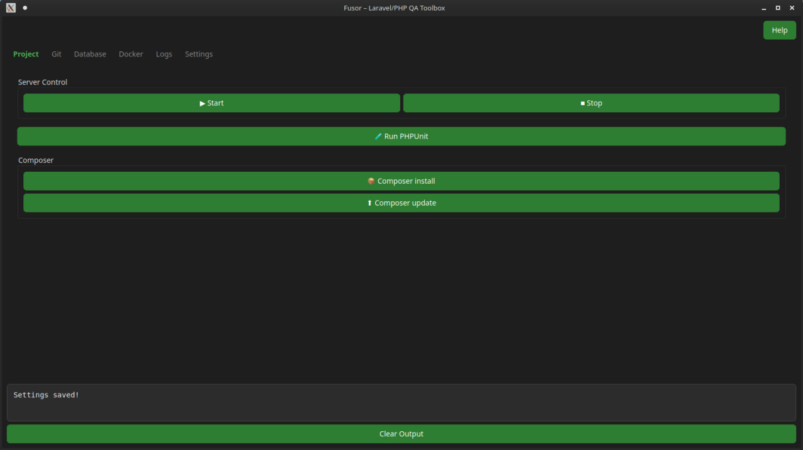

# Fusor

[](https://github.com/vix-4800/Fusor/actions/workflows/tests.yml)

**Fusor** is a cross-platform desktop app built with PyQt6 that helps you manage PHP-based projects without touching the terminal. It’s designed for QA engineers, testers, junior developers, and anyone who wants to execute common project tasks with a click.



---

## Project Goals

Fusor aims to **simplify routine PHP project operations** via a user-friendly visual interface. It’s especially useful for:

-   QA and manual testers who want to run tests or inspect logs
-   Developers switching between projects or frameworks
-   Teams using Docker, Laravel, Yii, or plain PHP setups

---

## Features

-   Support for **Laravel**, **Yii**, and plain PHP setups
-   **Dark mode** with a modern UI
-   Project switching and per-project settings
-   Optional **Docker mode** for containerized workflows
-   Git, database, and migration helpers
-   Basic Node/NPM commands
-   Configurable log viewer with auto-refresh
-   Isolated settings stored in `~/.fusor_config.json`

---

## Tab Overview

| Tab          | Description                                                                       |
| ------------ | --------------------------------------------------------------------------------- |
| **Project**  | Start/stop server, Composer install/update, PHP tools (PHPUnit, Rector, CS-Fixer) |
| **Git**      | Switch branches, view status or diff, pull, hard reset, stash changes             |
| **Database** | Dump or restore SQL, run migrations, seed data                                    |
| **Docker**   | Build, pull, restart services, inspect containers _(visible only in Docker mode)_ |
| **Node**     | Run npm install, dev, and build commands |
| **Yii**      | Common Yii console commands _(visible when framework is Yii)_                     |
| **Logs**     | View logs with optional auto-refresh                                              |
| **Settings** | Choose framework, set PHP binary, Docker config, and manage project list          |

---

## Quick Start

1. Ensure **Python 3.10 or newer** is installed.

2. Install the dependencies:

```bash
pip install -r requirements.txt
```

3. Run the application:

```bash
python -m fusor
```

Set the `APP_NAME` environment variable to customize the window title:

```bash
APP_NAME="My App" python -m fusor
```

---

## 🐳 Docker Mode

Enable the **Use Docker** option in the Settings tab to run commands inside your project's Docker containers.

-   Set **PHP Service** to match the container name in your `docker-compose.yml`
-   Support for multiple Compose files (separated by `;`)
-   Optional Compose profile via **Compose Profile** field
-   Set **Docker Project Path** if the code lives at a different path inside the container (default `/app`)
-   The **Docker** tab will appear automatically

Start/Stop buttons execute `docker compose up -d` and `docker compose down` (with `--profile` if specified) accordingly.

---

## Testing

Install the development dependencies and run the test suite:

```bash
pip install -r requirements-dev.txt
pytest -q
```

PyQt6 and pytest-qt are required for running the tests. Headless testing is supported by setting `QT_QPA_PLATFORM=offscreen`, already handled in the GitHub Actions workflow.

---

## Contributing

You're welcome to contribute!

-   Fork the repo
-   Create a new branch
-   Add your feature or fix
-   Submit a pull request

Ideas for UI improvements, framework support, or new tabs are always appreciated.

---

## License

This project is licensed under the [MIT License](LICENSE).
